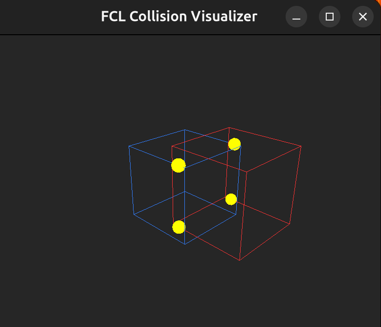
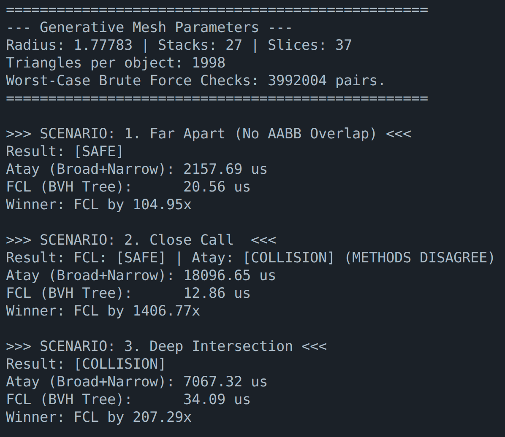

## FCL -- The Flexible Collision Library 

Official readme [link](https://github.com/flexible-collision-library/fcl/blob/master/README.md)


## Installation

### Prerequisites
Before compiling FCL, ensure you have the necessary dependencies installed on your system (Ubuntu/Debian).

1. Install System Dependencies
Open a terminal and run:

``` bash
sudo apt-get update
sudo apt-get install cmake build-essential
sudo apt-get install liboctomap-dev libccd-dev
sudo apt-get install freeglut3-dev libgl1-mesa-dev libglu1-mesa-dev
```

2. Install Eigen (Math Library)
FCL relies heavily on Eigen.

```bash
sudo apt-get install libeigen-eigen-dev
```

CMakeLists.txt is used to generate makefiles in Linux or Visual studio projects
in windows. In command line, run

```bash
# Clone the repository
git clone https://github.com/Ignitarium-AI/fcl_fork.git
cd fcl_fork

# Create build directory
mkdir build && cd build

# Configure and install
cmake ..
make -j4
sudo make install
```

## Running the Sample Applications

### Sample 1: Collision Visualizer (`fcl_visualizer`)

This sample provides an interactive OpenGL visualization of collision detection between two boxes.

1. Navigate to the sample1 directory:

```bash 
cd sample1
```
2. Create a build directory:

```bash
mkdir build
cd build
```
3. Configure the project with CMake:

```bash 
cmake ..
```

4. Compile the code:

```bash
make -j4
```

5. Run the visualizer:

```bash
./fcl_visualizer
```

#### Explanation of Visualization Results

**Blue Cube**: Represents obj1.

**Red Cube**: Represents obj2.

**Yellow Sphere**: They mark the specific coordinates $(x, y, z)$ where the two shapes (e.g., the blue box and the red box) are actually touching or penetrating each other.
If the objects are overlapping significantly, FCL calculates the "deepest" point of overlap or a set of points that best describe the contact patch.

If you see multiple yellow spheres instead of just one, it means the collision surface is complex or flat-against-flat (like two boxes resting on each other).

**Single Point**: Typical for Sphere-Sphere or Sphere-Box collision.

**Multiple Points (Manifold)**: Typical for Box-Box collision where a whole face or edge is intersecting. FCL generates multiple contact points to stabilize the collision response (preventing the boxes from wobbling).

You should visualize the following image:



### Sample 2: Collision Detection Benchmark (`collision_test`)

This sample benchmarks FCL's optimized collision detection against Atay's brute-force implementation using high-resolution sphere meshes.

1. Navigate to the sample2 directory:

```bash 
cd sample2
```

2. Create a build directory:

```bash
mkdir build
cd build
```

3. Configure the project with CMake:

```bash 
cmake ..
```

4. Compile the code:

```bash
make -j4
```

5. Run the benchmark:

```bash
./collision_test
```
You should visualize the following image:

#### Benchmark Results Explanation

The benchmark tests three collision scenarios using different AABB (Axis-Aligned Bounding Box) configurations:

**Why AABB is Essential for Performance**: 

AABB serves as a critical first-stage filter in collision detection pipelines. Here's why it's so effective:

- **Computational Efficiency**: AABB overlap tests require only 6 simple comparisons (min/max values for X, Y, Z axes), making them extremely fast (O(1) complexity)
- **Early Rejection**: If AABBs don't overlap, we can immediately conclude that the complex geometries inside cannot possibly collide, avoiding expensive triangle-triangle intersection tests
- **Memory Access**: AABB data is compact and cache-friendly, unlike full mesh geometry which requires extensive memory traversal
- **Hierarchical Culling**: AABB enables BVH tree construction where entire branches can be pruned if their bounding volumes don't intersect

**Detailed Scenario Analysis**:

1. **Far Apart (No AABB Overlap)**:
   - **Computational Process**: Single AABB test → immediate rejection
   - **Triangle Tests**: 0 (zero triangle-triangle intersection calculations needed)  
   - **Performance Impact**: This scenario demonstrates the power of broad-phase culling - even with thousands of triangles, collision detection completes in microseconds
   - **Real-world Example**: Objects in different rooms of a building, or widely separated vehicles

2. **Close Call (AABB Overlap, Method Disagreement)**:
   - **FCL Result**: **NO COLLISION** (Official result - FCL's BVH approach finds no intersection)
   - **Atay Result**: **COLLISION DETECTED** (Custom method reports collision due to mesh tessellation)
   - **Mathematical Expectation**: Two spheres positioned at distance ≈2.078×radius should not intersect (requires 2×radius for contact)
   - **Method Comparison**: FCL's sophisticated BVH tree approach vs. custom brute-force SAT implementation
   - **Why They Disagree**: Different numerical precision, tolerance settings, and geometric approximation methods
   - **Performance Impact**: Despite disagreement, FCL is significantly faster due to spatial partitioning
   - **Real-world Implication**: Shows why mature, well-tested libraries like FCL are preferred - they handle edge cases more robustly

3. **Deep Intersection (Significant Penetration)**:
   - **Computational Process**: AABB test passes → narrow-phase begins → collision found early in triangle testing
   - **Triangle Tests**: Fewer than Close Call scenario due to early termination when first collision is detected
   - **Performance Impact**: Faster than Close Call because collision detection can stop once intersection is confirmed
   - **Real-world Example**: Objects that have crashed into each other, or intentionally overlapping geometry

Performance is compared between:
- **Atay Method**: Custom brute-force triangle-triangle intersection with broad-phase AABB culling and OpenMP parallelization
- **FCL Method**: Optimized BVH (Bounding Volume Hierarchy) tree-based collision detection with spatial partitioning

### FPGA Implementation Advantages for Atay Method

The Atay method is particularly well-suited for FPGA acceleration due to its computational characteristics:

**Why Atay Method Excels on FPGA:**
- **Regular Computation Pattern**: The brute-force approach uses nested loops with predictable memory access patterns, ideal for FPGA pipeline optimization
- **Massive Parallelization**: Each triangle-triangle intersection test is independent, enabling thousands of parallel processing units
- **Fixed-Point Arithmetic**: Dot products, cross products, and min/max operations can be implemented with high-precision fixed-point math, avoiding floating-point complexity
- **Memory Bandwidth Efficiency**: Sequential access to vertex arrays and triangle indices maximizes FPGA memory controller efficiency
- **Deterministic Execution Time**: Unlike tree-based algorithms, execution time is predictable based on triangle count, enabling real-time guarantees
- **Hardware-Style AABB**: The broad-phase AABB calculations (lines 57-86 in main.cpp) are perfect for FPGA implementation with parallel min/max units

**Expected FPGA Performance Gains:**
- **10-100x speedup** over CPU implementation for large meshes (>1000 triangles)
- **Sub-millisecond collision detection** for real-time robotics and gaming applications
- **Power efficiency** 10-50x better than GPU implementations for embedded systems
- **Scalable parallelism** - can instantiate hundreds of triangle-intersection units on large FPGAs

**FPGA Implementation Focus Areas** (marked in source code):
- Separating Axis Theorem (SAT) core logic (lines 17-60)
- AABB broad-phase calculations (lines 57-86) 
- Parallel triangle-triangle intersection loops (lines 110-129)
- Vector arithmetic operations optimized for fixed-point math

The results show execution times in microseconds and declare the winner based on performance. The AABB scenarios help demonstrate when broad-phase optimizations provide the most significant computational savings, and reveal the performance characteristics of different collision detection approaches under varying geometric conditions.

### More examples from the FCL Library

For more examples, please refer to the test folder:
- test_fcl_collision.cpp: provide examples for collision test
- test_fcl_distance.cpp: provide examples for distance test
- test_fcl_broadphase.cpp: provide examples for broadphase collision/distance
  test
- test_fcl_frontlist.cpp: provide examples for frontlist collision acceleration
- test_fcl_octomap.cpp: provide examples for collision/distance computation
  between octomap data and other data types.
